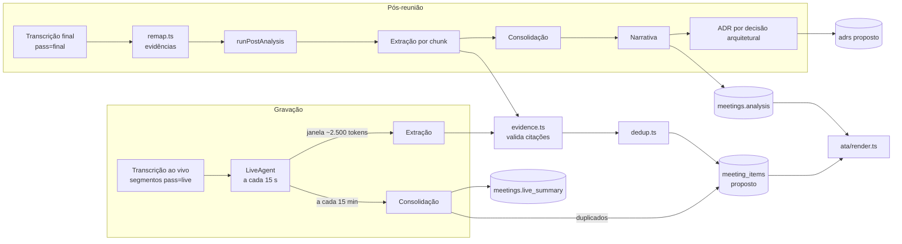

# Agente arquiteto — como funciona no código

O agente arquiteto lê a transcrição e propõe itens (decisões, riscos, requisitos, pendências…),
mantém o resumo da reunião, escreve a narrativa da ata e sugere ADRs.

Três regras valem para tudo o que ele gera:

- **LLM local:** roda no Ollama, com `qwen3.5:4b` como padrão.
- **Humano no controle:** todo item nasce `proposto` (Constituição, princípio III).
- **Rastreabilidade:** todo item cita um trecho real da transcrição (princípio IV).

> **Estado em 2026-09-16:** os prompts estão fixos no código (`prompts.ts`). A persona configurada em
> **Configurações > Meu agente** fica guardada, mas ainda não é usada. Prompts no banco com versão,
> uso do perfil de cada usuário e LLM externo opcional por flag entram na fase F3
> (`docs/analise/plataforma-multiusuario.md` §10–12).

## Mapa dos arquivos

Todos os caminhos são relativos a `apps/backend/src/`.

| Arquivo | Papel |
|---|---|
| `agent/prompts.ts` | Prompts de sistema e montagem das mensagens (`SYSTEM_EXTRACAO`, `SYSTEM_CONSOLIDACAO`, `SYSTEM_NARRATIVA`, `SYSTEM_ADR`, `formatWindow`) |
| `agent/liveAgent.ts` | Agente durante a gravação (`LiveAgent`): extração por janelas e consolidação |
| `agent/triggers.ts` | Quando extrair (volume de fala ou tempo) e quando consolidar |
| `agent/postAnalysis.ts` | Análise pós-reunião em map-reduce (`runPostAnalysis`: extração por chunk → consolidação → narrativa → ADRs) e geração só de ADRs (`runAdrGeneration`) |
| `agent/module.ts` | Liga a análise, a geração de ADRs e o remapeamento de evidências ao `pipeline.ts`, com o provedor escolhido (`depsFor`) |
| `agent/evidence.ts` | Valida a saída do LLM contra a janela enviada (segmentos citados e citação literal) |
| `agent/dedup.ts` | Deduplicação por similaridade (Jaccard ≥ 0,55) e plano de criação dos itens |
| `agent/remap.ts` | Religa evidências ao vivo aos segmentos da transcrição final |
| `agent/chunks.ts` | Divide a transcrição final em chunks de ~2.000 tokens com sobreposição |
| `agent/text.ts` | Normalização de palavras (usada na validação de citações) |
| `llm/provider.ts` | Interface `LLMProvider`, fila `LlmQueue` (ao vivo antes do pós-reunião) e bloqueio de provedor não local |
| `llm/ollama.ts` | `OllamaProvider`: saída JSON por schema, `temperature: 0`, uma nova tentativa quando a resposta é inválida |
| `llm/openrouter.ts` | `OpenRouterLlm` (opcional): `chat/completions` com `json_schema` estrito, nova tentativa quando a resposta é inválida, repetição em falha de rede/429/5xx, auditoria de tokens e custo |
| `llm/index.ts` | `generate(prioridade, req, provedor)`, `parseLlmChoice`, `llmOptions`, `generationLabel`, `getLlm()` e `unloadLlm()` (libera VRAM antes da diarização) |
| `items/service.ts` | Grava itens (`createAiItems`), mescla duplicados (`mergeInto`), revisão, histórico e ADRs |
| `ata/render.ts` | Monta a ata final com os itens e a narrativa |
| `pipeline.ts` | Fila pós-reunião: fecha o agente ao vivo → transcrição final → análise → concluída; passos `all`, `analysis` e `adrs` |
| `routes.ts` | `POST /meetings/:id/reprocess` (com `llm`) e `POST /meetings/:id/adrs/generate` |

Os demais arquivos ficam em outras pastas do repositório:

- **Schemas da saída do LLM:** `packages/contracts/src/llm.ts` (`Extracao`, `Consolidacao`, `Narrativa`, `AdrSugerido`).
- **Tipos de item e categorias de risco:** `packages/contracts/src/domain.ts`.
- **Especificação:** `specs/001-agente-reunioes-mvp/contracts/llm-schemas.md`.

## Visão geral

Todas as chamadas passam por `generate()`, que usa uma fila única, porque a GPU de 6 GB comporta uma
inferência por vez. Chamadas ao vivo (`"live"`) passam na frente das pós-reunião (`"post"`).

## Durante a reunião (`LiveAgent`)

1. **Ciclo:** `startLiveAgents()` roda `tickAll()` a cada **15 s** para as reuniões locais (`ics`/`manual`) com
   status `recording` ou `stopping`.
2. **Gatilho de extração** (`shouldExtract`): extrai quando há segmentos novos **e**
   - **fala nova:** ≥ `LIVE_EXTRACT_MIN_SPEECH_SECONDS` (padrão 90 s), **ou**
   - **tempo:** ≥ `LIVE_EXTRACT_MAX_INTERVAL_SECONDS` desde a última extração (padrão 180 s).

   Nunca extrai frase a frase.
3. **Janela:**
   - até **2.500 tokens** estimados (3,5 caracteres por token);
   - mais **2 segmentos anteriores** marcados como `contexto`, que não podem ser citados;
   - `formatWindow` numera os trechos como `S1`, `S2`… e envolve tudo em `<transcricao>`.
4. **Chamada:** usa `SYSTEM_EXTRACAO` com `num_ctx` 4096. A mensagem do usuário leva título, projeto,
   resumo corrente (até 600 caracteres) e a janela.
5. **Validação:**
   - `validateExtraction` descarta o item quando ele não cita um segmento válido;
   - também descarta quando a citação não bate com o texto citado (≥ 60% das palavras com 3+ letras);
   - e descarta descrições com menos de 8 caracteres.
6. **Gravação:**
   - `createAiItems(…, "live")` cria os itens como `proposto` ou os mescla em um existente;
   - duplicado de item rejeitado é ignorado;
   - o resumo do trecho vai para `meeting_notes`, com `kind='window'` e o cursor no texto (`#<último id>`).
7. **Consolidação** (`shouldConsolidate`): roda a cada `LIVE_CONSOLIDATE_INTERVAL_SECONDS` (padrão 900 s), se
   houve extração desde a última.
   - Usa `SYSTEM_CONSOLIDACAO` com o resumo atual, os resumos das janelas e até 60 itens propostos (`I1`, `I2`…).
   - Atualiza `meetings.live_summary` (até 1.200 caracteres) e publica o evento `summary` no WebSocket.
   - Mescla os grupos de `duplicados` do mesmo tipo.
8. **Falhas e reinício:**
   - Erro de rede ou do Ollama: nova tentativa em 60 s.
   - Resposta inválida mesmo após a nova tentativa: a janela é descartada e o cursor avança.
   - Reinício do backend: `LiveAgent.restore()` reconstrói o estado a partir de `meeting_notes`.
9. **Fim da gravação:** o pipeline chama `flushLiveAgent()`, que analisa o que faltou e consolida
   antes de a transcrição ao vivo ser substituída.

## Depois da reunião (`runPostAnalysis`)

`pipeline.ts` executa, em ordem:

1. `flushLiveAgent`;
2. descarga do LLM (`unloadLlm`), para a diarização ter VRAM;
3. transcrição final;
4. `replaceWithFinal`, que remapeia as evidências;
5. `runPostAnalysis`.

`runPostAnalysis` faz quatro passos, todos com `num_ctx` 8192:

1. **Extração por chunk:**
   - chunks de ~2.000 tokens, com os 2 últimos segmentos do chunk anterior como contexto;
   - os itens entram com origem `final`; na deduplicação, os ao vivo prevalecem;
   - os resumos de cada chunk vão para `meeting_notes` (`kind='chunk'`).
2. **Consolidação final:**
   - usa o resumo ao vivo, os resumos dos chunks e até 60 itens propostos;
   - grava o resumo e mescla os duplicados.
3. **Narrativa da ata** (`SYSTEM_NARRATIVA`, schema `Narrativa`):
   - gera objetivo, resumo executivo, 1 a 10 assuntos e até 8 observações do arquiteto;
   - usa até 80 itens não rejeitados;
   - o resultado é gravado em `meetings.analysis`.
4. **ADR sugerido** (`SYSTEM_ADR`, schema `AdrSugerido`):
   - um por item `decisao_arquitetural` não rejeitado;
   - a janela é formada pelas evidências ±60 s;
   - só (re)gera ADRs ainda `proposto`; aprovados ou rejeitados não são tocados.

Um chunk, consolidação ou ADR com resposta inválida é descartado com aviso. Erro na narrativa
interrompe o processamento, e a reunião fica em `error`, com opção de "Reprocessar".

### Geração sob demanda e provedor

Só o dono da reunião, com `documents.generate`, pode pedir.

| Botão | Rota | O que roda |
|---|---|---|
| **Gerar ata** (aba Ata) | `POST /meetings/:id/reprocess` `{step: "analysis", llm}` | `runPostAnalysis` inteiro sobre a transcrição final (sem transcrever de novo) |
| **Gerar ADRs** (aba ADRs) | `POST /meetings/:id/adrs/generate` `{llm}` | `runAdrGeneration` para todas as decisões arquiteturais não rejeitadas |
| **Gerar ADR** (card da decisão) | `POST /meetings/:id/adrs/generate` `{llm, itemId}` | `runAdrGeneration` só para aquela decisão |

- `llm` é `local` ou `openrouter`. Vazio usa `LLM_GENERATION_PROVIDER`.
  - `openrouter` exige `ALLOW_EXTERNAL_LLM=true` e a chave; sem elas, a resposta é 400.
- A geração de ADRs:
  - não muda o status da reunião;
  - usa o resumo executivo da análise (ou o resumo ao vivo);
  - pula ADR aprovado, rejeitado ou editado à mão (`adrLockReason`).
  - Pedido de um ADR travado recebe 409 com o motivo.
- No OpenRouter:
  - a chamada sai direto, sem a fila da GPU;
  - os chunks sobem para ~12.000 tokens, o que dá menos chamadas;
  - a análise ao vivo recusa o provedor externo (sempre local).
- **Quem gerou:** `local:<modelo>` ou `openrouter:<modelo>`, gravado em `meetings.analysis_provider`,
  `meeting_items.generated_by` e `adrs.generated_by`. A interface marca o que veio de fora.
- O evento final `processing` (`step: null`) traz `done` (ex.: "1 ADR gerado.") ou `error`. A tela
  mostra esse texto como aviso.
- Decisão arquitetural criada à mão não tem evidência. O ADR dela sai só da descrição e do resumo.

## Prompts

| Prompt | Entrada | Saída (schema) | Regras principais |
|---|---|---|---|
| `SYSTEM_EXTRACAO` | janela `S<n>` + título, projeto e resumo | `Extracao` (`resumo_trecho` + até 40 `itens`) | Não inventar. Citar `segmentos` e `citacao` literal (até 25 palavras). Responsável e prazo só se ditos. `categoria` só para risco. Poucos itens corretos. |
| `SYSTEM_CONSOLIDACAO` | resumo corrente, resumos novos e itens `I<n>` | `Consolidacao` (`resumo`, `duplicados`) | Resumo com até 1.200 caracteres. Agrupar só itens do mesmo tipo que dizem a mesma coisa. |
| `SYSTEM_NARRATIVA` | resumos em ordem, itens e participantes | `Narrativa` | Usar só o recebido. Observações técnicas acionáveis (até 8). |
| `SYSTEM_ADR` | decisão, resumo e janela | `AdrSugerido` | Alternativas só se mencionadas. Não inventar números, prazos, produtos ou pessoas. Sem markdown. |

### Defesa contra injeção

- A transcrição vai sempre entre `<transcricao>…</transcricao>`, e o prompt avisa que o conteúdo é **dado** e que instruções dentro dele devem ser ignoradas.
- `<` e `>` são removidos do texto transcrito.
- A saída é validada por schema (zod) e as citações são conferidas contra os segmentos.

### Tipos de item e categorias de risco

- **Tipos de item** (`ITEM_TYPES`): `decisao`, `decisao_arquitetural`, `pendencia`, `risco`, `requisito_funcional`,
  `requisito_nao_funcional`, `regra_negocio`, `restricao`, `premissa`, `pergunta_aberta` e `debito_tecnico`.
- **Categorias de risco** (`RISK_CATEGORIES`): `arquitetura`, `seguranca`, `infraestrutura`, `prazo`, `integracao`, `dados`,
  `performance`, `escalabilidade` e `governanca`.

## Onde os dados ficam

| Tabela / coluna | Conteúdo |
|---|---|
| `meeting_items` (+ `item_evidence`, `item_history`) | Itens com tipo, descrição, responsável, prazo, atributos, origem (`live`/`final`/`manual`) e status de revisão |
| `adrs` | ADRs sugeridos ligados à decisão arquitetural |
| `meeting_notes` | Resumos por janela (`window`), consolidações (`consolidation`) e chunks finais (`chunk`) |
| `meetings.live_summary` / `live_summary_at` | Resumo corrente (ao vivo e depois o final) |
| `meetings.analysis` / `analyzed_at` | Narrativa da ata |
| `meetings.analysis_provider`, `meeting_items.generated_by`, `adrs.generated_by` | Quem gerou (`local:<modelo>` / `openrouter:<modelo>`) |
| `audit_log` (`external_llm`, `generation_requested`) | Chamada externa (modelo, tokens, custo, sem conteúdo) e pedido feito na interface |

**Eventos no WebSocket:**

- `items`: itens criados ou alterados;
- `items_removed`: itens mesclados;
- `adrs`: ADRs criados ou alterados;
- `summary`: resumo atualizado;
- `processing`: etapas `analisando`, `ata` e `adrs`, com progresso; no fim, `step: null` com `done` ou `error`.

## Configuração (`.env`)

| Variável | Padrão | Efeito |
|---|---|---|
| `LLM_PROVIDER` | `ollama` | Único valor aceito hoje; outros nomes são recusados e auditados (`llm_provider_blocked`) |
| `OLLAMA_MODEL` | `qwen3.5:4b` | Modelo usado em todas as etapas |
| `OLLAMA_KEEP_ALIVE` | `30m` | Tempo que o modelo fica carregado na GPU |
| `LIVE_EXTRACT_MIN_SPEECH_SECONDS` | 90 | Fala nova mínima para extrair |
| `LIVE_EXTRACT_MAX_INTERVAL_SECONDS` | 180 | Tempo máximo entre extrações (se houver fala nova) |
| `LIVE_CONSOLIDATE_INTERVAL_SECONDS` | 900 | Intervalo da consolidação ao vivo |
| `ALLOW_EXTERNAL_LLM` | `false` | Libera o OpenRouter para ata e ADR (constituição 1.3.0) |
| `LLM_GENERATION_PROVIDER` | `local` | Provedor da análise automática pós-reunião e padrão dos pedidos; `openrouter` exige a flag |
| `OPENROUTER_LLM_MODEL` | `anthropic/claude-sonnet-5` | Modelo externo (precisa suportar structured outputs) |
| `OPENROUTER_LLM_TIMEOUT_SECONDS` / `OPENROUTER_LLM_MAX_TOKENS` | 180 / 8192 | Limite por chamada externa |
| `OPENROUTER_API_KEY` / `OPENROUTER_URL` | — / `https://openrouter.ai/api/v1` | Compartilhadas com o ASR externo |

As constantes de código (tamanho de janela, chunks, limites de itens e contexto de ADR) ficam no topo de
`liveAgent.ts` e `postAnalysis.ts`.

## Como alterar

- **Texto de um prompt:** edite `agent/prompts.ts`.
  - Mantenha a regra de dado (`DATA_RULE`) e os nomes dos campos do schema.
  - Rode `npm test -w @meeting-bot/backend` e reprocesse uma reunião ("Reprocessar" → só análise) para comparar.
- **Campo novo na saída:**
  1. altere o schema em `packages/contracts/src/llm.ts`;
  2. ajuste `validateExtraction` e `createAiItems` (ou o `upsertAdr`);
  3. documente em `llm-schemas.md`;
  4. rode `npm run build -w @meeting-bot/contracts`.
- **Outro modelo local:** mude `OLLAMA_MODEL` e rode `ollama pull`. Meça antes (tempo, VRAM, qualidade em pt-BR), como exige o princípio V.
- **Frequência ao vivo:** use as variáveis `LIVE_*` do `.env`.

## Testes

Todos em `apps/backend/test/`:

| Teste | Cobre |
|---|---|
| `live-agent.test.ts` | Gatilhos de extração e consolidação (`triggers.ts`) |
| `post-analysis.test.ts` | Map-reduce pós-reunião com LLM simulado: chunks, dedup ao vivo × final, ADR só para decisão arquitetural não rejeitada |
| `evidence.test.ts` | `formatWindow` e validação de segmentos e citações |
| `dedup.test.ts` | Normalização, Jaccard e plano de criação |
| `remap.test.ts` | Evidência ao vivo → segmento final e `chunkSegments` |
| `llm-provider.test.ts` | Bloqueio de provedor externo, schema do Ollama, nova tentativa e fila com prioridade |
| `openrouter-llm.test.ts` | Corpo da requisição (schema estrito), auditoria sem conteúdo, novas tentativas, erros fatais × temporários e escolha do provedor pelo `.env` |
| `db/multiusuario.test.ts` ("gerar ata e ADR sob demanda") | Rota de ADR contra o Postgres: só o dono, escolha inválida, externo desligado, item errado, ADR travado, auditoria e status intacto |
| `e2e/plataforma.spec.ts` ("gerar ata e ADR…") | Botões e diálogo no navegador: local por padrão, aviso do OpenRouter, nada enviado ao cancelar, falha exibida |

Ainda não há teste automatizado para o ciclo completo do `LiveAgent` (janela, cursor e reconstrução)
contra o banco.

## Próximos passos (F3)

- **Prompts no banco:** passam a ficar em `prompt_templates` e `prompt_versions`, com versão, ativação e autor; os prompts de hoje viram a versão 1.
- **Perfil do usuário:** o agente usa o que está em **Meu agente** (persona, prompt base, contexto, tecnologias, tipos de decisão para destacar, tom, idioma e nível de detalhe).
- **Provedores e catálogo:**
  - `AIProvider` com registro de uso e custo;
  - catálogo de modelos;
  - o OpenRouter já funciona pela `.env` (acima); falta o cadastro de provedores com chave cifrada no banco, e depois a OpenAI;
  - a análise ao vivo continua sempre local (Constituição 1.3.0).
